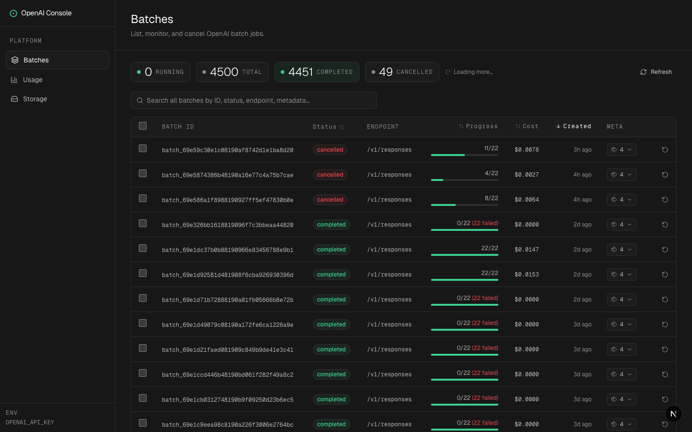
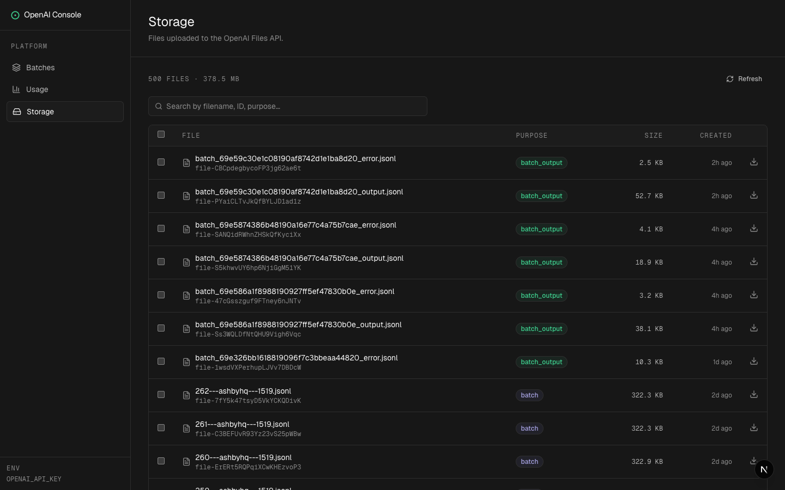
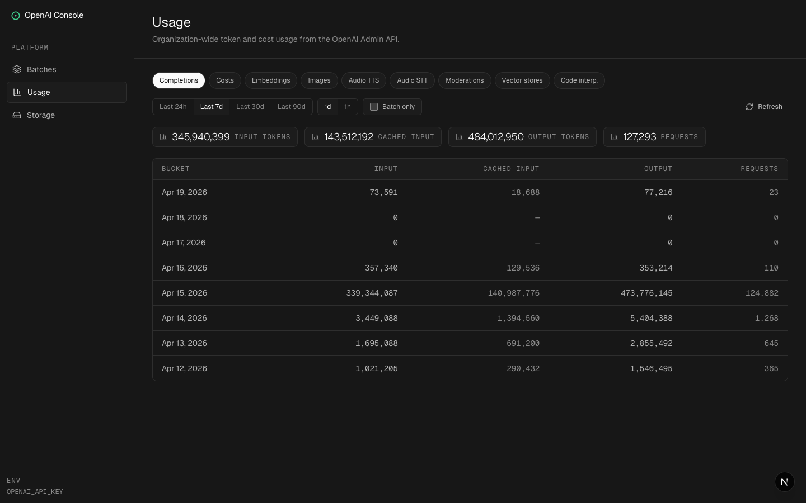

# OpenAI Batch Dashboard

Self-hosted dashboard for monitoring and managing OpenAI Batch API jobs, usage and file storage.

    

> Your OpenAI API key stays on your machine. All calls are proxied from your own Next.js server — nothing is sent to a third party.

## Screenshots





## Why

The OpenAI dashboard shows batches, but it won't let you cancel many at once, restart a failed job without re-uploading the file, estimate cost before running, or browse per-response output as a conversation. This does.

## Features

### Batches
- List every batch with live status, progress bar, token usage, and **estimated cost**
- Search across ID, status, endpoint, or metadata
- **Cancel** running batches individually or in bulk
- **Restart** completed, failed, or expired batches (re-submits the original input file — no re-upload)
- Per-batch detail: request counts, token breakdown, cost split, timeline, associated files
- Browse responses with pagination — **conversation view** (input + assistant output rendered as markdown) or raw JSON
- Auto-polls for new batches every 30s

### Storage
- List uploaded files with filename, purpose, size, created date
- Search by filename, file ID, or purpose
- Download files directly via the browser

### Usage
- Organization-wide token and cost usage from OpenAI's Admin API
- Tabs for Completions, Costs, Embeddings, Images, Audio, Moderations, Vector stores, Code interpreter
- 24h / 7d / 30d / 90d ranges, 1d or 1h buckets, optional batch-only filter
- Requires a separate `OPENAI_ADMIN_KEY` (see Configuration)

### Cost Estimation
- Batch API pricing for 30+ models (GPT-5.x, GPT-4.x, o-series, GPT-3.5)
- Splits input, cached input, and output costs
- All estimates reflect the 50% Batch API discount

### Local-First Caching
- Uses **SQLite (WASM)** in a Web Worker, persisted to **OPFS**, to cache batches, files, and response outputs across reloads
- Falls back to in-memory SQLite when OPFS is unavailable
- Lazy-loads up to 5,000 batches and 500 files with background pagination

### UI
- Supabase-inspired dark theme — never pure black, sparing emerald accents, border-defined depth
- Mobile-responsive: collapsible drawer, horizontal-scrolling tables, stacking layouts

## Quick Start

**Requirements:** Node.js 18+, an OpenAI API key.

```bash
git clone https://github.com/<your-fork>/openai-batch-dashboard
cd openai-batch-dashboard
npm install
cp .env.local.example .env.local
# edit .env.local and set OPENAI_API_KEY=sk-...
npm run dev
```

Open [http://localhost:3000](http://localhost:3000).

### Scripts

| Command | Purpose |
|---|---|
| `npm run dev` | Start dev server (auto-copies sqlite-wasm to `public/`) |
| `npm run build` | Production build |
| `npm start` | Serve production build |
| `npm run lint` | ESLint |

## Stack

| Layer | Technology |
|---|---|
| Framework | Next.js 16 (App Router) |
| UI | React 19 + Tailwind CSS v4 |
| Components | Radix UI primitives + CVA |
| Icons | lucide-react |
| OpenAI | `openai` SDK v6 |
| Cache | `@sqlite.org/sqlite-wasm` (OPFS-SAH) in a Web Worker |
| Markdown | react-markdown + remark-gfm |

## Project Structure

```
src/
  app/
    batches/
      page.tsx              # Batches list page
      batches-client.tsx    # Table, search, pagination, modals
      [id]/
        page.tsx            # Batch detail (direct URL)
        batch-detail.tsx    # Tabs, timeline, responses table
    storage/
      page.tsx
      storage-client.tsx    # File list UI
    api/
      batches/              # list, get, cancel, restart
      files/                # list, download
      responses/            # response input_items proxy
  components/
    layout-shell.tsx        # Mobile drawer state
    sidebar.tsx             # Drawer on mobile, static on desktop
    mobile-topbar.tsx
    page-header.tsx
    response-modal.tsx      # Conversation + raw JSON
    ui/                     # button, badge (CVA)
  lib/
    db/                     # SQLite worker + typed client
    pricing.ts              # Batch API cost estimation
    batch-output-cache.ts   # Response output caching layer
    utils.ts                # cn, formatRelative, formatBytes, formatDate
```

## API Routes

All routes proxy to OpenAI using `OPENAI_API_KEY`. The key never leaves your server.

| Route | Method | Description |
|---|---|---|
| `/api/batches` | GET | List batches (`limit`, `after` cursor) |
| `/api/batches/[id]` | GET | Get single batch |
| `/api/batches/cancel` | POST | Cancel one or more batches |
| `/api/batches/restart` | POST | Clone and re-submit batches |
| `/api/files` | GET | List files (`limit`, `after` cursor) |
| `/api/files/download` | GET | Stream file content |
| `/api/responses/[id]/input_items` | GET | Fetch response input items |
| `/api/usage` | GET | Org usage / costs (requires `OPENAI_ADMIN_KEY`). Params: `type`, `start_time`, `end_time`, `bucket_width`, `group_by`, `batch`, `limit`, `page` |

## Configuration

Only one env var is required:

```env
OPENAI_API_KEY=sk-...
```

Optional — enables the `/usage` page:

```env
OPENAI_ADMIN_KEY=sk-admin-...
```

This must be an **admin** key (created at *platform.openai.com → Settings → Admin keys*), not a project key. Admin keys only work on `/v1/organization/*` endpoints; they cannot fetch batches or files. Leave it unset and `/usage` shows a friendly empty state while the rest of the app works normally.

Runs fine on Vercel, Fly, Railway, or any Node host. If you deploy publicly, put it behind auth — the dashboard has no auth layer of its own.

## Notes

- Cost estimates use Batch API rates and are approximations; check your OpenAI bill for the authoritative number.
- Restart copies the original input file on OpenAI's side and submits a fresh batch — your local file storage is not touched.
- OPFS-SAH requires cross-origin isolation headers when served over HTTPS; locally it Just Works.

## Contributing

Issues and PRs welcome. See `TODO.md` for known gaps. `DESIGN.md` documents the Supabase-inspired design tokens if you're adding UI.

## License

MIT
